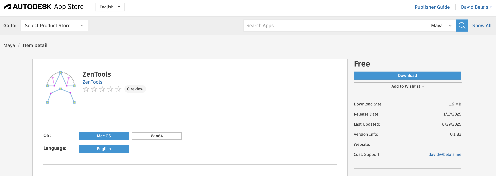
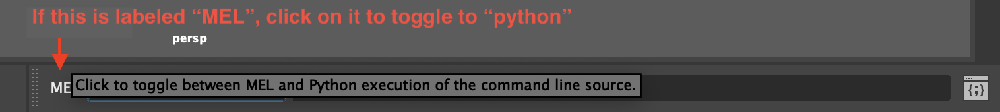
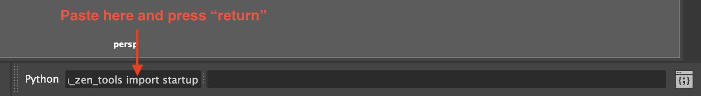
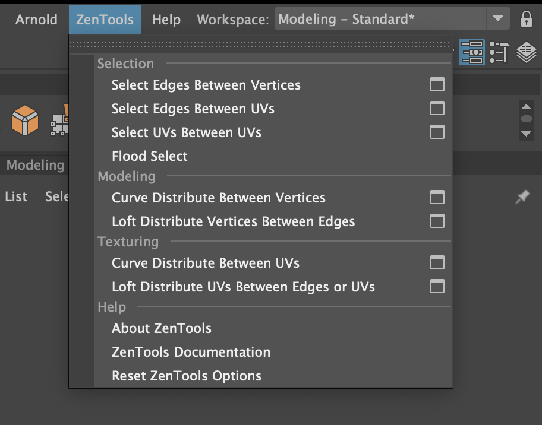

# Installation

## Autodesk App Store

[Installers for Mac or Windows can be downloaded (free) from the Autodesk App
Store.](https://apps.autodesk.com/MAYA/en/Detail/Index?id=4634919975196540444)

[](https://apps.autodesk.com/MAYA/en/Detail/Index?id=4634919975196540444)

## Script Editor Installation

You can install ZenTools for Maya by copy/pasting the following python snippet
into your script editor, executing ([cmd] + [return] or [ctrl] + [enter]),
then restarting Maya:

```python
import os;
from subprocess import check_call;
from pathlib import Path;

mayapy: str = str(
    Path(os.environ.get("MAYA_LOCATION")).joinpath("bin", "mayapy")
);
check_call([mayapy, "-m", "pip", "install", "maya-zen-tools"]);
check_call([mayapy, "-m", "maya_zen_tools", "install"])
```

-   In Maya, select the "modeling" menu set. You can do this from the top-left
    corner of the user interface.

    

-   In the bottom-right corner of the Maya user interface, make
    sure your script editor is toggled to "python".

    

-   In the bottom-right corner of the Maya user interface, paste the
    above snippet of python code into your script editor, then press "return".

    

The ZenTools menu will now be visible whenever you are in the "Modeling" menu
set.



## Command Line Installation

For most users, script editor installation will be the quickest/easiest way
to install ZenTools. For network/system administrators wishing to automate
workstation configurations, however, command-line installation will be more
expedient.

You can install ZenTools for Maya with the following command, if you have added
the `mayapy` interpreter's parent directory to your system path:

```bash
mayapy -m pip install maya-zen-tools && mayapy -m maya_zen_tools.install
```

The location of `mayapy` will depend on your Maya version and operating system:

| Platform | Location                                                            |
|----------|---------------------------------------------------------------------|
| Windows  | `C:\Program Files\Autodesk\Maya<VersionNumber>\bin\`                |
| Linux    | `/usr/autodesk/Maya<VersionNumber>/bin/`                            |
| macOS    | `/Applications/Autodesk/maya<VersionNumber>/Maya.app/Contents/bin/` |
