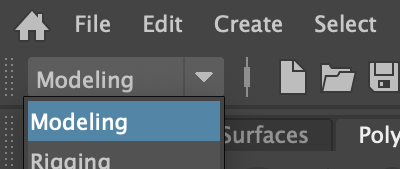
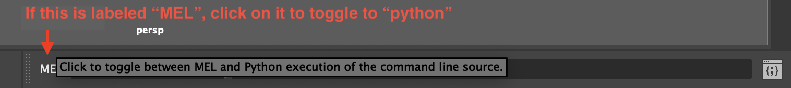

# Installation

## Script Editor Installation

You can install ZenTools for Maya by copy/pasting the following python snippet
into your script editor (the semicolons are necessary in order to avoid
opening the multi-line script editor):

```python
import sys;
from subprocess import check_call;
from pathlib import Path;
from maya import cmds;

install_directory: Path = Path(cmds.internalVar(mayaInstallDir=True));
mayapy: str = str(
    install_directory.joinpath("Maya.app", "Contents", "bin", "mayapy")
    if sys.platform == "darwin"
    else install_directory.joinpath("bin", "mayapy")
);
check_call([mayapy, "-m", "pip", "install", "maya-zen-tools"]);
from maya_zen_tools import install, startup;
install.main()
```

-   In Maya, select the "modeling" menu set. You can do this from the top-left
    corner of the user interface.

    

-   In the bottom-right corner of the Maya user interface, make
    sure your script editor is toggled to "python".

    

-   In the bottom-right corner of the Maya user interface, paste the
    above snippet of python code into your script editor, then press "return".

    

## Command Line Installation

For most users, script editor installation will be the quickest/easiest way
to install ZenTools. For network/system administrators wishing to automate
workstation configurations, however, command-line installation will be more
expedient.

You can install ZenTools for Maya with the following command, if you have added
the `mayapy` interpreter's parent directory to your system path:

```bash
mayapy -m pip install maya-zen-tools && mayapy -m maya_zen_tools.install
```

The location of `mayapy` will depend on your Maya version and operating system:

| Platform | Location                                                            |
|----------|---------------------------------------------------------------------|
| Windows  | `C:\Program Files\Autodesk\Maya<VersionNumber>\bin\`                |
| Linux    | `/usr/autodesk/Maya<VersionNumber>/bin/`                            |
| macOS    | `/Applications/Autodesk/maya<VersionNumber>/Maya.app/Contents/bin/` |